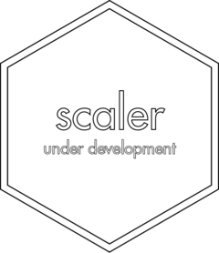

<!-- README.md is generated from README.Rmd. Please edit that file -->

# scaler <a href='https://gipso.github.io/scaler'></a>

<!-- badges: start -->

[](https://www.repostatus.org/#wip)
[](https://lifecycle.r-lib.org/articles/stages.html#experimental)
[](https://github.com/gipso/scaler/actions)
[](https://codecov.io/gh/gipso/scaler?branch=main)
[](https://choosealicense.com/licenses/mit/)
<!-- badges: end -->

## Overview

`scaler` is an R package that provides a set of tools to deal with
different health measurement scales. The aim of `scaler` is to
facilitate the work of researches while also helping with research
reproducibility.

Some scales requires a dedicated package. If you’re looking for tools to
process the Munich ChronoType Questionnaire
([MCTQ](https://doi.org/10.1177/0748730402239679)), please check the
[`mctq`](http://gipso.github.io/mctq) package.

> Please note that this package is currently on the development stage
> and have not yet been [peer
> reviewed](https://devguide.ropensci.org/softwarereviewintro.html).

## Prerequisites

You only need to have some familiarity with the [R programming
language](https://www.r-project.org/) to use `scaler` main functions.

In case you don’t feel comfortable with R, we strongly recommend
checking Hadley Wickham and Garrett Grolemund’s free and online book [R
for data Science](https://r4ds.had.co.nz/) and the Coursera course from
John Hopkins University [Data Science: Foundations using
R](https://www.coursera.org/specializations/data-science-foundations-r)
(free for audit students).

## Installation

`scaler` is still at the
[experimental](https://lifecycle.r-lib.org/articles/stages.html#experimental)
stage of development. That means people can use the package and provide
feedback, but it comes with no promises for long term stability.

You can install `scaler` from GitHub with:

``` r
# install.packages("remotes")
remotes::install_github("gipso/scaler")
```

## Citation

If you use `scaler` in your research, please consider citing it. We put
a lot of work to build and maintain a free and open-source R package.
You can find the `scaler` citation below.

``` r
citation("scaler")
#> 
#> To cite {scaler} in publications use:
#> 
#>   Vartanian, D., Pedrazzoli, M. (2021). {scaler}: an R package for
#>   health measurement scales. https://gipso.github.io/scaler/.
#> 
#> A BibTeX entry for LaTeX users is
#> 
#>   @Unpublished{,
#>     title = {{scaler}: an R package for health measurement scales},
#>     author = {Daniel Vartanian and Mario Pedrazzoli},
#>     year = {2021},
#>     url = {https://gipso.github.io/scaler/},
#>     note = {Lifecycle: experimental},
#>   }
```

## Contributing

`scaler` is a community project, everyone is welcome to contribute. Take
a moment to review our [Guidelines for
Contributing](https://gipso.github.io/scaler/CONTRIBUTING.html).

Please note that `scaler` is released with a [Contributor Code of
Conduct](https://gipso.github.io/scaler/CODE_OF_CONDUCT.html). By
contributing to this project, you agree to abide by its terms.

## Support `scaler`

[](https://ko-fi.com/danielvartan)

Working with science in Brazil is a daily challenge. There are few
funding opportunities available and their value is not enough to live
on. Added to this, every day Brazilian science suffers from deep cuts in
funding, which requires researchers to always look for other sources of
income.

If this package helps you in any way or you simply want to support the
author’s work, please consider donating or even creating a membership
subscription (if you can!). Your support will help with the author’s
scientific pursuit and with the package maintenance.

To make a donation click on the [Ko-fi](https://ko-fi.com/danielvartan)
button above. Please indicate the `scaler` package in your donation
message.

Thank you!
